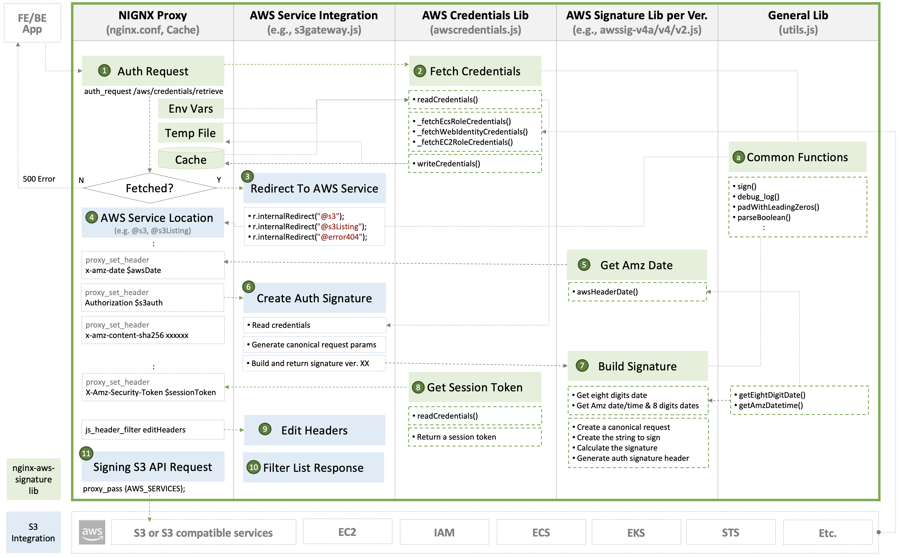

# Development Guide

## Integrating with AWS Signature

Run the script of [`submodule.sh`](../submodule.sh) to update the module of `nginx-aws-signature`.
- Common `nginx-aws-signature` lib: [`https://github.com/nginxinc/nginx-aws-signature`](https://github.com/nginxinc/nginx-aws-signature)
- Pull the latest version of `nginx-aws-signature` when updating new lib.
  ```
  cd common/etc/nginx/include/awssig
  git pull -f
  ```

Update the following files when enhancing `nginx-s3-gateway` to integrate with AWS signature whenever AWS releases a new version of signature or you have a new PR:

- NGINX Proxy: [`/etc/nginx/conf.d/default.conf`](/common/etc/nginx/templates/gateway/s3_location.conf.template)
- AWS Credentials Lib: [`/etc/nginx/include/awssig/core/awscredentials.js`](/common/etc/nginx/include/awssig/core/awscredentials.js)
- AWS Signature Lib per version:
  - [`/etc/nginx/include/awssig/core/awssig2.js`](/common/etc/nginx/include/awssig/core/awssig2.js)
  - [`/etc/nginx/include/awssig/core/awssig4.js`](/common/etc/nginx/include/awssig/core/awssig4.js)

- S3 Integration Lib: [`/etc/nginx/include/s3gateway.js`](/common/etc/nginx/include/s3gateway.js)
- Common Lib for all of NJS: [`/etc/nginx/include/awssig/core/utils.js`](/common/etc/nginx/include/awssig/core/utils.js)



## Extending the Gateway

### Extending gateway configuration via container images

#### `conf.d` Directory

On the container image, all files with the extension `.conf` in the 
directory `/etc/nginx/conf.d` will be loaded into the configuration
of the base `http` block within the main NGINX configuration.

This allows for extension of the configuration by adding additional
configuration files into the container image extending the base
gateway image.

#### Stub Files

On the container image there are three NGINX configuration stub files:

* [`/etc/nginx/conf.d/s3_server.conf`](/common/etc/nginx/templates/gateway/s3_location.conf.template)
* [`/etc/nginx/conf.d/s3_location.conf`](/common/etc/nginx/templates/gateway/s3_server.conf.template) 
* [`/etc/nginx/conf.d/s3listing_location.conf`](/common/etc/nginx/templates/gateway/s3listing_location.conf.template)

Each of these files can be overwritten in a container image that inherits
from the S3 Gateway container image, so that additional NGINX configuration
directives can be inserted into the gateway configuration.

### Examples

In the [examples/ directory](/examples), there are `Dockerfile` examples that 
show how to extend the base functionality of the NGINX S3 Gateway by adding
additional modules.

* [Enabling Brotli Compression in Docker](/examples/brotli-compression)
* [Enabling GZip Compression in Docker](/examples/gzip-compression)
* [Installing Modsecurity in Docker](/examples/modsecurity)

## Testing

Automated tests require `docker`, `docker-compose`, `curl` and `md5sum` to be
installed. To run all unit tests and integration tests, run the following command.
If you invoke the test script with a plus parameter, you will need to add your
NGINX repository keys to the `plus/etc/ssl/nginx` directory

```
$ ./test.sh <nginx type - 'oss', 'latest-njs-oss', 'unprivileged', 'plus', or 'latest-njs-plus'>
```
