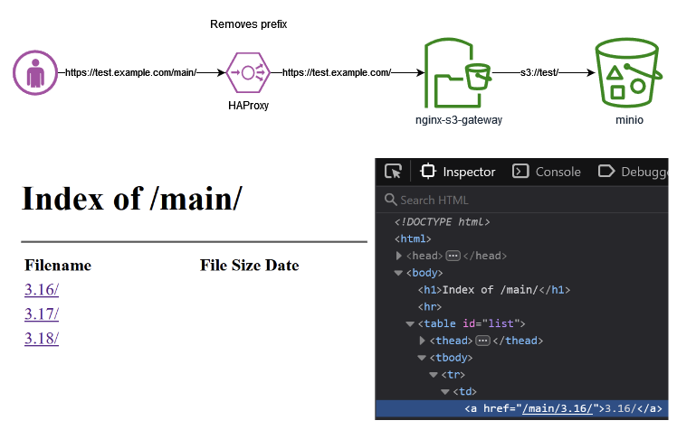

# Getting Started Guide

## Contents

[Configuration](#configuration)  
[Running as a Systemd Service](#running-as-a-systemd-service)  
[Running in Containers](#running-in-containers)  
[Running Using AWS Instance Profile Credentials](#running-using-aws-instance-profile-credentials)  
[Running on EKS with IAM roles for service accounts](#running-on-eks-with-iam-roles-for-service-accounts)  
[Running on EKS with EKS Pod Identities](#running-on-eks-with-eks-pod-identities)  
[Troubleshooting](#troubleshooting)  

## Configuration

The following environment variables are used to configure the gateway when
running as a Container or as a Systemd service.

| Name                                  | Required? | Allowed Values               | Default   | Description                                                                                                                                                                                                                                                                                                                                                                                                                                                  |
| ------------------------------------- | --------- | ---------------------------- | --------- | ------------------------------------------------------------------------------------------------------------------------------------------------------------------------------------------------------------------------------------------------------------------------------------------------------------------------------------------------------------------------------------------------------------------------------------------------------------ |
| `ALLOW_DIRECTORY_LIST`                | Yes       | `true`, `false`              | `false`   | Flag enabling directory listing                                                                                                                                                                                                                                                                                                                                                                                                                              |
| `AWS_SIGS_VERSION`                    | Yes       | 2, 4                         |           | AWS Signatures API version                                                                                                                                                                                                                                                                                                                                                                                                                                   |
| `AWS_ACCESS_KEY_ID`                   | Yes       |                              |           | Access key                                                                                                                                                                                                                                                                                                                                                                                                                                                   |
| `AWS_SECRET_ACCESS_KEY`               | Yes       |                              |           | Secret access key                                                                                                                                                                                                                                                                                                                                                                                                                                            |
| `AWS_SESSION_TOKEN`                   | No        |                              |           | Session token.                                                                                                                                                                                                                                                                                                                                                                                                                                               |
| `S3_BUCKET_NAME`                      | Yes       |                              |           | Name of S3 bucket to proxy requests to                                                                                                                                                                                                                                                                                                                                                                                                                       |
| `S3_REGION`                           | Yes       |                              |           | Region associated with API                                                                                                                                                                                                                                                                                                                                                                                                                                   |
| `S3_SERVER_PORT`                      | Yes       |                              |           | SSL/TLS port to connect to                                                                                                                                                                                                                                                                                                                                                                                                                                   |
| `S3_SERVER_PROTO`                     | Yes       | `http`, `https`              |           | Protocol to used connect to S3 server                                                                                                                                                                                                                                                                                                                                                                                                                        |
| `S3_SERVER`                           | Yes       |                              |           | S3 host to connect to                                                                                                                                                                                                                                                                                                                                                                                                                                        |
| `S3_STYLE`                            | Yes       | `virtual-v2`, `virtual`, `path`, `default` | `default` | The S3 host/path method. <br><br>`virtual` and `virtual-v2` represent the method that uses DNS-style bucket+hostname:port. The `default` is the same as `virtual`. In the future, the `default` value will become `virtual-v2`. See [Choosing a `S3_STYLE` Setting](#user-content-choosing-a-s3_style-setting) below for details. <br><br>`path` is a method that appends the bucket name as the first directory in the URI's path. This method is used by many S3 compatible services. See this [AWS blog article](https://aws.amazon.com/blogs/aws/amazon-s3-path-deprecation-plan-the-rest-of-the-story/) for further information. |
| `S3_SERVICE`                          | Yes       | `s3`, `s3express`            | `s3`      | Configures the gateway to interface with either normal S3 buckets or S3 Express One Zone                                                                                                                                                                                                                                                                                                                                                                     |
| `DEBUG`                               | No        | `true`, `false`              | `false`   | Flag enabling AWS signatures debug output                                                                                                                                                                                                                                                                                                                                                                                                                    |
| `APPEND_SLASH_FOR_POSSIBLE_DIRECTORY` | No        | `true`, `false`              | `false`   | Flag enabling the return a 302 with a `/` appended to the path. This is independent of the behavior selected in `ALLOW_DIRECTORY_LIST` or `PROVIDE_INDEX_PAGE`.                                                                                                                                                                                                                                                                                              |
| `DIRECTORY_LISTING_PATH_PREFIX`       | No        |                              |           | In `ALLOW_DIRECTORY_LIST=true` mode [adds defined prefix to links](#configuring-directory-listing)                                                                                                                                                                                                                                                                                                                                                           |
| `DNS_RESOLVERS`                       | No        |                              |           | DNS resolvers (separated by single spaces) to configure NGINX with                                                                                                                                                                                                                                                                                                                                                                                           |
| `PROXY_CACHE_MAX_SIZE`                | No        |                              | `10g`     | Limits cache size                                                                                                                                                                                                                                                                                                                                                                                                                                            |
| `PROXY_CACHE_INACTIVE`                | No        |                              | `60m`     | Cached data that are not accessed during the time specified by the parameter get removed from the cache regardless of their freshness                                                                                                                                                                                                                                                                                                                        |
| `PROXY_CACHE_SLICE_SIZE`              | No        |                              | `1m`      | For requests with a `Range` header included, determines the size of the chunks in which the file is fetched. Values much smaller than the requests can lead to inefficiencies due to reading and writing many files. See [below for more details](#byte-range-requests-and-caching)                                                                                                                                                                          |
| `PROXY_CACHE_VALID_OK`                | No        |                              | `1h`      | Sets caching time for response code 200 and 302                                                                                                                                                                                                                                                                                                                                                                                                              |
| `PROXY_CACHE_VALID_NOTFOUND`          | No        |                              | `1m`      | Sets caching time for response code 404                                                                                                                                                                                                                                                                                                                                                                                                                      |
| `PROXY_CACHE_VALID_FORBIDDEN`         | No        |                              | `30s`     | Sets caching time for response code 403                                                                                                                                                                                                                                                                                                                                                                                                                      |
| `PROVIDE_INDEX_PAGE`                  | No        | `true`, `false`              | `false`   | Flag which returns the index page if there is one when requesting a directory.                                                                                                                                                                                                                                                                                                                                                                               |
| `JS_TRUSTED_CERT_PATH`                | No        |                              |           | Enables the `js_fetch_trusted_certificate` directive when retrieving AWS credentials and sets the path (on the container) to the specified path                                                                                                                                                                                                                                                                                                              |
| `HEADER_PREFIXES_TO_STRIP`            | No        |                              |           | A list of HTTP header prefixes that exclude headers from client responses. List should be specified in lower-case and a semicolon (;) should be used to as a delimiter between values. For example: x-goog-;x-something-. Headers starting with x-amz- will be stripped by default for security reasons unless explicitly added in HEADER_PREFIXES_ALLOWED.                                                                                              |
| `HEADER_PREFIXES_ALLOWED`             | No        |                              |           | A list of allowed prefixes for HTTP headers that are returned to the client in responses. List should be specified in lower-case and a semicolon (;) should be used to as a delimiter between values. For example: x-amz-;x-something-. It is NOT recommended to return x-amz- headers for security reasons. Think carefully about what is allowed here.                                                                                           |
| `CORS_ENABLED`                        | No        | `true`, `false`              | `false`   | Flag that enables CORS headers on GET requests and enables pre-flight OPTIONS requests. If enabled, this will add CORS headers for "fully open" cross domain requests by default, meaning all domains are allowed, similar to the settings show in [this example](https://enable-cors.org/server_nginx.html). CORS settings can be fine-tuned by overwriting the [`cors.conf.template`](/common/etc/nginx/templates/gateway/cors.conf.template) file.        |
| `CORS_ALLOWED_ORIGIN`                 | No        |                              |           | Value to set to be returned from the CORS `Access-Control-Allow-Origin` header. This value is only used if CORS is enabled. (default: \*)                                                                                                                                                                                                                                                                                                                    |
| `STRIP_LEADING_DIRECTORY_PATH`                 | No        |                              |           | Removes a portion of the path in the requested URL (if configured). Useful when deploying to an ALB under a folder (eg. www.mysite.com/somepath).                                                                                                                                                                                                                                                                                                                    |
| `PREFIX_LEADING_DIRECTORY_PATH`                 | No        |                              |           | Prefix to prepend to all S3 object paths. Useful to serve only a subset of an S3 bucket. When used in combination with `STRIP_LEADING_DIRECTORY_PATH`, this allows the leading path to be replaced, rather than just removed.                                                                                                                                                                                                                                                                                                                    |
| `CORS_ALLOW_PRIVATE_NETWORK_ACCESS`   | No        | `true`, `false`              |           | Flag that enables responding to the CORS OPTIONS pre-flight request header `Access-Control-Request-Private-Network` with the `Access-Control-Allow-Private-Network` header. If the value is "true", responds with "true", if "false" responds with "false". If the environment variable is blank/not set, does not respond with any header. This value is only used if CORS is enabled. See [Private Network Access: introducing preflights](https://developer.chrome.com/blog/private-network-access-preflight/) for more information about this header. |


If you are using [AWS instance profile credentials](https://docs.aws.amazon.com/IAM/latest/UserGuide/id_roles_use_switch-role-ec2.html),
you will need to omit the `AWS_ACCESS_KEY_ID`, `AWS_SECRET_ACCESS_KEY` and `AWS_SESSION_TOKEN` variables from
the configuration.

When running with Docker, the above environment variables can be set in a file 
with the `--env-file` flag. When running as a Systemd service, the environment
variables are specified in the `/etc/nginx/environment` file. An example of
the format of the file can be found in the [settings.example](/settings.example)
file.
  
There are few optional environment variables that can be used.

* `AWS_ROLE_SESSION_NAME` - (optional) The value will be used for Role Session Name. The default value is nginx-s3-gateway.
* `STS_ENDPOINT` - (optional) Overrides the STS endpoint to be used in applicable setups. This is not required when running on EKS. See the EKS portion of the guide below for more details.
* `AWS_STS_REGIONAL_ENDPOINTS` - (optional) Allows for a regional STS endpoint to be
  selected. When the regional model is selected then the STS endpoint generated will
  be coded to the current AWS region. This environment variable will be ignored if
  `STS_ENDPOINT` is set. Valid options are: `global` (default) or `regional`.

### Choosing a `S3_STYLE` Setting
**If you are using AWS S3 or S3 Express One Zone, use `virtual-v2`.** We are maintaining `virtual` temporarily until we hear from the community that `virtual-v2` does not cause issues - or we introduce a versioning system that allows us to safely flag breaking changes.
Until then, `virtual` works as before, and `default` still causes the `virtual` behavior to be used.

**`virtual-v2` is not expected to be a breaking change** but we are being cautious.

A full reference for S3 addressing styles may be found [here](https://docs.aws.amazon.com/AmazonS3/latest/userguide/VirtualHosting.html)

Here is the difference between `virtual` and `virtual-v2`:
#### virtual
* Proxied endpoint: `S3_SERVER:S3_SERVER_PORT`
* `Host` header: `S3_BUCKET_NAME}.S3_SERVER`
* `host` field in the [S3 V4 `CanonicalHeaders`](https://docs.aws.amazon.com/AmazonS3/latest/API/sig-v4-header-based-auth.html): `S3_BUCKET_NAME}.S3_SERVER`

#### virtual-v2
All items are set to the same value:
* Proxied endpoint: `S3_BUCKET_NAME.S3_SERVER:S3_SERVER_PORT`
* `Host` header: `S3_BUCKET_NAME.S3_SERVER:S3_SERVER_PORT`
* `host` field in the [S3 V4 `CanonicalHeaders`](https://docs.aws.amazon.com/AmazonS3/latest/API/sig-v4-header-based-auth.html): `S3_BUCKET_NAME.S3_SERVER:S3_SERVER_PORT`

#### path
`path` style routing does not prepend the bucket name to the host, and includes it as the first segment in the request path.  AWS is actively trying to move away from this method. Some S3 compatible object stores may require that you use this setting - but try to avoid it if your object store works with `virtual-v2`.


### Configuring Directory Listing

Listing of S3 directories ([folders](https://docs.aws.amazon.com/AmazonS3/latest/userguide/using-folders.html)) is supported when the
`ALLOW_DIRECTORY_LIST` environment variable is set to `1`. Directory listing 
output can be customized by changing the
[XSL stylesheet](https://www.w3schools.com/xml/xsl_intro.asp): [`common/etc/nginx/include/listing.xsl`](/common/etc/nginx/include/listing.xsl).
If you are not using AWS S3 as your backend, you may see some inconsistency in 
the behavior with how directory listing works with HEAD requests. Additionally,
due to limitations in proxy response processing, invalid S3 folder requests will 
result in log messages like:
```
 libxml2 error: "Extra content at the end of the document"
```

Another limitation is that when using v2 signatures with HEAD requests, the
gateway will not return 200 for valid folders.

#### Prefixing List Results

The gateway can be configured to prefix all list results with a given string.
This is useful if you are proxying the gateway itself and wish to relocate
the path of the files returned from the listing.
Using the `DIRECTORY_LISTING_PATH_PREFIX` environment variable will allow
one to add that prefix in listing page's header and links.

For example, if one configures to `DIRECTORY_LISTING_PATH_PREFIX='main/'` and 
then uses HAProxy to proxy the gateway with the 
`http-request set-path %[path,regsub(^/main,/)]` setting, the architecture
will look like the following: 



### Static Site Hosting

When `PROVIDE_INDEX_PAGE` environment variable is set to 1, the gateway will
transform `/some/path/` to `/some/path/index.html` when retrieving from S3.  
Default of "index.html" can be edited in `s3gateway.js`. 
It will also redirect `/some/path` to `/some/path/` when S3 returns 404 on 
`/some/path` if `APPEND_SLASH_FOR_POSSIBLE_DIRECTORY` is set. `path` has to 
look like a possible directory, it must not start with a `.` and not have an 
extension.  

### Hosting a Bucket as a Subfolder on an ALB

The `STRIP_LEADING_DIRECTORY_PATH` environment variable allows one to host an
S3 bucket in a subfolder on an ALB.  For example, if you wanted to expose the
root of a bucket under the path "www.mysite.com/somepath", you would set this
variable to "/somepath".

## Byte-Range Requests and Caching
The gateway caches [byte-range](https://developer.mozilla.org/en-US/docs/Web/HTTP/Range_requests) (requests sent with a `Range` header) requests differently than normal requests.

The gateway is configured to cache such requests in chunks of size `PROXY_CACHE_SLICE_SIZE`. If you don't provide this configuration value it will default to 1 megabyte.

This means that if you request 2.5 megabytes of a 1 gigabyte file, the gateway will cache 3 megabytes and nothing else.

Setting your slice size too small can have performance impacts since NGINX performs a subrequest for each slice. For more details see the [official reference](http://nginx.org/en/docs/http/ngx_http_slice_module.html).

You may make byte-range requests and normal requests for the same file and NGINX will automatically handle them differently.  The caches for file chunks and normal file requests are separate on disk.

## Usage with AWS S3 Express One Zone
The gateway may be used to proxy files in the AWS S3 Express One Zone product (also called Directory Buckets).

To do so, be sure that `S3_STYLE` is set to `virtual-v2`. Additionally, the `S3_SERVER` configuration must be set a combination of the bucket name and the [Zonal Endpoint](https://docs.aws.amazon.com/AmazonS3/latest/userguide/s3-express-networking.html#s3-express-endpoints).

### Directory Bucket Names
See the [official documentation](https://docs.aws.amazon.com/AmazonS3/latest/userguide/directory-bucket-naming-rules.html) for the most up to date rules on Directory Bucket naming.

Directory Buckets must have names matching this format:
```
bucket-base-name--azid--x-s3
```
For example:
```
bucket-base-name--usw2-az1--x-s3
```
### Final Configuration
The bucket name must be prepended to the zonal endpoint like this
```
bucket-base-name--usw2-az1--x-s3.s3express-usw2-az1.us-west-2.amazonaws.com
```
The above is the value that must be provided to the `S3_SERVER` variable.
Additionally, the `S3_BUCKET_NAME` must be set to the full bucket name with the suffix:
```
bucket-base-name--usw2-az1--x-s3
```
Buckets created in the AWS UI don't require manual specification of a suffix but it must be included in the gateway configuration.

### Trying it Out
A sample Terraform script to provision a bucket is provided in `/deployments/s3_express`.

## Running as a Systemd Service

An [install script](/standalone_ubuntu_oss_install.sh) for the gateway shows
how to install NGINX from a package repository, checkout the gateway source, 
and configure it using the supplied environment variables.

To run the script copy it to your destination system, load the environment
variables mentioned in the [configuration section](#configuration) into memory,
and then execute the script. The script takes one optional parameter that 
specifies the name of the branch to download files from.

For example:
```shell-session
sudo env $(cat settings.example) ./standalone_ubuntu_oss_install.sh
```

## Running in Containers

### Running the Public Open Source NGINX Container Image

The latest builds of the gateway (that use open source NGINX) are available on 
the project's Github [package repository](https://github.com/nginxinc/nginx-s3-gateway/pkgs/container/nginx-s3-gateway%2Fnginx-oss-s3-gateway).

To run with the public open source image, replace the `settings` file specified
below with a file containing your settings, and run the following command:
```
docker run --env-file ./settings --publish 80:80 --name nginx-s3-gateway \
    ghcr.io/nginxinc/nginx-s3-gateway/nginx-oss-s3-gateway:latest
```

If you would like to run with the latest njs version, run:
```
docker run --env-file ./settings --publish 80:80 --name nginx-s3-gateway \
    ghcr.io/nginxinc/nginx-s3-gateway/nginx-oss-s3-gateway:latest-njs-oss 
```

Alternatively, if you would like to pin your version to a specific point in
time release, find the version with an embedded date and run:
```
docker run --env-file ./settings --publish 80:80 --name nginx-s3-gateway \
    ghcr.io/nginxinc/nginx-s3-gateway/nginx-oss-s3-gateway:latest-njs-oss-20220310
```

### Building the Public Open Source NGINX Container Image

In order to build the NGINX OSS container image, do a `docker build` as follows
from the project root directory:

```
docker build --file Dockerfile.oss --tag nginx-s3-gateway:oss --tag nginx-s3-gateway .
```

Alternatively, if you would like to use the latest version of
[njs](https://nginx.org/en/docs/njs/), you can build an image from the latest 
njs source by building this image after building the parent image above:
```
docker build --file Dockerfile.oss --tag nginx-s3-gateway --tag nginx-s3-gateway:latest-njs-oss .
```

After building, you can run the image by issuing the following command and 
replacing the path to the `settings` file with a file containing your specific
environment variables.
```
docker run --env-file ./settings --publish 80:80 --name nginx-s3-gateway \
    nginx-s3-gateway:oss
```

In the same way, if you want to use NGINX OSS container image as a non-root, unprivileged user,
you can build it as follows:
```
docker build --file Dockerfile.unprivileged --tag nginx-s3-gateway --tag nginx-s3-gateway:unprivileged-oss .
```
And run the image binding the container port 8080 to 80 in the host like:
```
docker run --env-file ./settings --publish 80:8080 --name nginx-s3-gateway \
    nginx-s3-gateway:unprivileged-oss
```

It is worth noting that due to the way the startup scripts work, even the unprivileged container will not work with a read-only root filesystem or a specific uid/gid set other then the default of  `101`.

### Building the NGINX Plus Container Image

In order to build the NGINX Plus container image, copy your NGINX Plus 
repository keys (`nginx-repo.crt` and `nginx-repo.key`) into the 
`plus/etc/ssl/nginx` directory before building.

If you are using a version of Docker that supports Buildkit, then you can
build the image as follows in order to prevent your private keys from
being stored in the container image.

To build, run the following from the project root directory:

```
DOCKER_BUILDKIT=1 docker build \
    --file Dockerfile.buildkit.plus \
    --tag nginx-plus-s3-gateway --tag nginx-plus-s3-gateway:plus \
    --secret id=nginx-crt,src=plus/etc/ssl/nginx/nginx-repo.crt \
    --secret id=nginx-key,src=plus/etc/ssl/nginx/nginx-repo.key \
    --squash .
```

Otherwise, if you don't have Buildkit available, then build as follows. If you
want to remove the private keys from the image, then you may need to do a
post-build squash operation using a utility like
[docker-squash](https://pypi.org/project/docker-squash/).

```
docker build --file Dockerfile.plus --tag nginx-plus-s3-gateway --tag nginx-plus-s3-gateway:plus .
``` 

Alternatively, if you would like to use the latest version of
[njs](https://nginx.org/en/docs/njs/) with NGINX Plus, you can build an image
from the latest njs source by building this image after building the parent 
image above:
```
docker build --file Dockerfile.plus --tag nginx-plus-s3-gateway --tag nginx-plus-s3-gateway:latest-njs-plus .
```

After building, you can run the image by issuing the following command and
replacing the path to the `settings` file with a file containing your specific
environment variables.
```
docker run --env-file ./settings --publish 80:80 --name nginx-plus-s3-gateway \
    nginx-plus-s3-gateway:plus
```

## Running Using AWS Instance Profile Credentials

[AWS instance profiles](https://docs.aws.amazon.com/AWSEC2/latest/UserGuide/iam-roles-for-amazon-ec2.html#ec2-instance-profile)
allow you to assign a role to a compute so that other AWS services can trust
the instance without having to store authentication keys in the compute 
instance. This is useful for the gateway because it allows us to run the
gateway without storing an unchanging `AWS_ACCESS_KEY_ID`, `AWS_SECRET_ACCESS_KEY` and 
`AWS_SESSION_TOKEN` in a file on disk or in an easily read environment variable.

Instance profiles work by providing credentials to the instance via the
[AWS Metadata API](https://docs.aws.amazon.com/AWSEC2/latest/UserGuide/instancedata-data-retrieval.html).
When the API is queried, it provides the keys allowed to the instance. Those
keys regularly expire, so services using them must refresh frequently.

### Running in EC2 with an IAM Policy

Following the [AWS documentation](https://docs.aws.amazon.com/AWSEC2/latest/UserGuide/iam-roles-for-amazon-ec2.html#permission-to-pass-iam-roles)
we can create a IAM role and launch an instance associated with it. On that
instance, if we run the gateway as a Systemd service there are no additional
steps. We just run the install script without specifying the
`AWS_ACCESS_KEY_ID`, `AWS_SECRET_ACCESS_KEY` and `AWS_SESSION_TOKEN` environment variables.

However, if we want to run the gateway as a container instance on that 
EC2 instance, then we will need to run the following command using the AWS
CLI tool to allow the metadata endpoint to be accessed from within a container.

```
aws ec2 modify-instance-metadata-options --instance-id <instance id> \
    --http-put-response-hop-limit 3 --http-endpoint enabled
```

After that has been run we can start the container normally and omit the
`AWS_ACCESS_KEY_ID`, `AWS_SECRET_ACCESS_KEY` and `AWS_SESSION_TOKEN` environment variables.

### Running in ECS with an IAM Policy

The commands below all reference the [`deployments/ecs/cloudformation/s3gateway.cf`](/deployments/ecs/cloudformation/s3gateway.yaml) file. This file will need to be
modified.

- Update the following 4 parameters in the `Parameters` section of the CloudFormation file for your specific AWS account:
  - `NewBucketName` - any S3 bucket name. Remember that S3 bucket names must be globally unique
  - `VpcId` - Any VPC ID on your AWS account
  - `Subnet1` - Any subnet ID that's in the VPC used above
  - `Subnet2` - Any subnet ID that's in the VPC used above
- Run the following command to deploy the stack (this assumes you have the AWS CLI & credentials setup correctly on your host machine and you are running in the project root directory):

  ```sh
  aws cloudformation create-stack \
    --stack-name nginx-s3-gateway \
    --capabilities CAPABILITY_NAMED_IAM \
    --template-body file://deployments/ecs/cloudformation/s3gateway.yaml
  ```

- Wait for the CloudFormation Stack deployment to complete
  (can take about 3-5 minutes)
  - You can query the stack status with this command:
    ```sh
    aws cloudformation describe-stacks \
      --stack-name nginx-s3-gateway \
      --query "Stacks[0].StackStatus"
    ```
- Wait until the query above shows `"CREATE_COMPLETE"`
- Run the following command to get the URL used to access the service:
  ```sh
  aws cloudformation describe-stacks \
    --stack-name nginx-s3-gateway \
    --query "Stacks[0].Outputs[0].OutputValue"
  ```
  - Upload a file to the bucket first to prevent getting a `404` when visiting 
    the URL in your browser
  ```sh
  # i.e.
  aws s3 cp README.md s3://<bucket_name>
  ```
- View the container logs in CloudWatch from the AWS web console
- Run the following command to delete the stack and all resources:
  ```sh
  aws cloudformation delete-stack \
    --stack-name nginx-s3-gateway
  ```

## Running on EKS with IAM roles for service accounts

If you are planning to use the container image on an EKS cluster, you can use a [service account]((https://docs.aws.amazon.com/eks/latest/userguide/iam-roles-for-service-accounts.html)) which can assume a role using [AWS Security Token Service](https://docs.aws.amazon.com/STS/latest/APIReference/API_AssumeRoleWithWebIdentity.html).

- Create a new [AWS IAM OIDC Provider](https://docs.aws.amazon.com/eks/latest/userguide/enable-iam-roles-for-service-accounts.html). If you are using AWS EKS Cluster, then the IAM OIDC Provider should already be created as the part of cluster creation. So validate it before you create the new IAM OIDC Provider.
- Configuring a [Kubernetes service account to assume an IAM role](https://docs.aws.amazon.com/eks/latest/userguide/associate-service-account-role.html)
- [Annotate the Service Account](https://docs.aws.amazon.com/eks/latest/userguide/cross-account-access.html) using IAM Role create in the above step.
- [Configure your pods, Deployments, etc to use the Service Account](https://docs.aws.amazon.com/eks/latest/userguide/pod-configuration.html)
- As soon as the pods/deployments are updated, you will see the couple of Env Variables listed below in the pods.
  - `AWS_ROLE_ARN` - Contains IAM Role ARN
  - `AWS_WEB_IDENTITY_TOKEN_FILE`  - Contains the token which will be used to create temporary credentials using AWS Security Token Service.
- You must also set the `AWS_REGION` and `JS_TRUSTED_CERT_PATH` environment variables as shown below in addition to the normal environment variables listed in the Configuration section.

The following is a minimal set of resources to deploy:
```yaml
apiVersion: v1
kind: ServiceAccount
metadata:
  name: nginx-s3-gateway
  annotations:
    eks.amazonaws.com/role-arn: "<role-arn>"
    # See https://docs.aws.amazon.com/eks/latest/userguide/configure-sts-endpoint.html
    eks.amazonaws.com/sts-regional-endpoints: "true"
---
apiVersion: apps/v1
kind: Deployment
metadata:
  name: nginx-s3-gateway
spec:
  replicas: 1
  selector:
    matchLabels:
      app: nginx-s3-gateway
  template:
    metadata:
      labels:
        app: nginx-s3-gateway
    spec:
      serviceAccountName: nginx-s3-gateway
      containers:
        - name: nginx-s3-gateway
          image: "ghcr.io/nginxinc/nginx-s3-gateway/nginx-oss-s3-gateway:latest-20220916"
          imagePullPolicy: IfNotPresent
          env:
            - name: S3_BUCKET_NAME
              value: "<bucket>"
            - name: S3_SERVER
              value: "s3.<aws region>.amazonaws.com"
            - name: S3_SERVER_PROTO
              value: "https"
            - name: S3_SERVER_PORT
              value: "443"
            - name: S3_STYLE
              value: "virtual"
            - name: S3_REGION
              value: "<aws region>"
            - name: AWS_REGION
              value: "<aws region>"
            - name: AWS_SIGS_VERSION
              value: "4"
            - name: ALLOW_DIRECTORY_LIST
              value: "false"
            - name: PROVIDE_INDEX_PAGE
              value: "false"
            - name: JS_TRUSTED_CERT_PATH
              value: "/etc/ssl/certs/Amazon_Root_CA_1.pem"

          ports:
            - name: http
              containerPort: 80
              protocol: TCP
          livenessProbe:
            httpGet:
              path: /health
              port: http
          readinessProbe:
            httpGet:
              path: /health
              port: http
```
## Running on EKS with EKS Pod Identities

An alternative way to use the container image on an EKS cluster is to use a service account which can assume a role using [Pod Identities](https://docs.aws.amazon.com/eks/latest/userguide/pod-identities.html).
- Installing the [Amazon EKS Pod Identity Agent](https://docs.aws.amazon.com/eks/latest/userguide/pod-id-agent-setup.html) on the cluster
- Configuring a [Kubernetes service account to assume an IAM role with EKS Pod Identity](https://docs.aws.amazon.com/eks/latest/userguide/pod-id-association.html)
- [Configure your pods, Deployments, etc to use the Service Account](https://docs.aws.amazon.com/eks/latest/userguide/pod-configuration.html)
- As soon as the pods/deployments are updated, you will see the couple of Env Variables listed below in the pods.
  - `AWS_CONTAINER_CREDENTIALS_FULL_URI` - Contains the Uri of the EKS Pod Identity Agent that will provide the credentials 
  - `AWS_CONTAINER_AUTHORIZATION_TOKEN_FILE`  - Contains the token which will be used to create temporary credentials using the EKS Pod Identity Agent.

The minimal set of resources to deploy is the same than for [Running on EKS with IAM roles for service accounts](#running-on-eks-with-iam-roles-for-service-accounts), except there is no need to annotate the service account:
```yaml
apiVersion: v1
kind: ServiceAccount
metadata:
  name: nginx-s3-gateway
```

## Troubleshooting

### Disable default `404` error message
The default behavior of the container is to return a `404` error message for any non-`200` response code. This is implemented as a security feature to sanitize any error response from the S3 bucket being proxied. For container debugging purposes, this sanitization can be turned off by commenting out the following lines within [`default.conf.template`](https://github.com/nginxinc/nginx-s3-gateway/blob/master/common/etc/nginx/templates/default.conf.template). 
```bash
proxy_intercept_errors on;
error_page 400 401 402 403 404 405 406 407 408 409 410 411 412 413 414 415 416 417 418 420 422 423 424 426 428 429 431 444 449 450 451 500 501 502 503 504 505 506 507 508 509 510 511 =404 @error404;
```

### Error `403 Access Denied` for AWS Accounts with MFA Enabled
The REST authentication method used in this container does not work with AWS IAM roles that have MFA enabled for authentication. Please use AWS IAM role credentials that do not have MFA enabled. 
